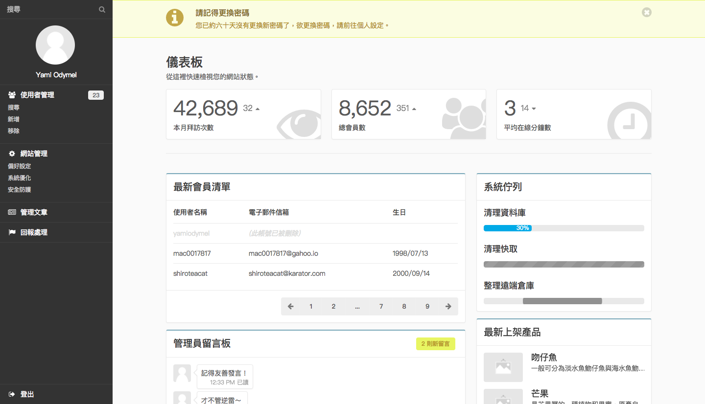
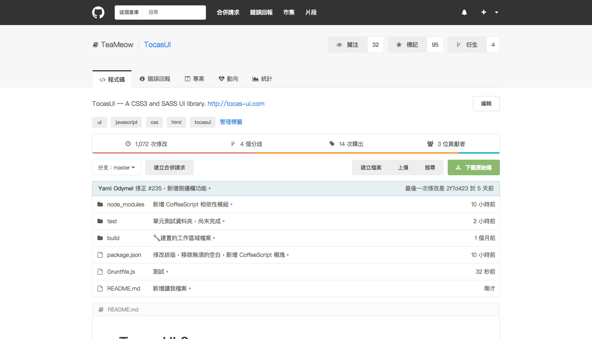
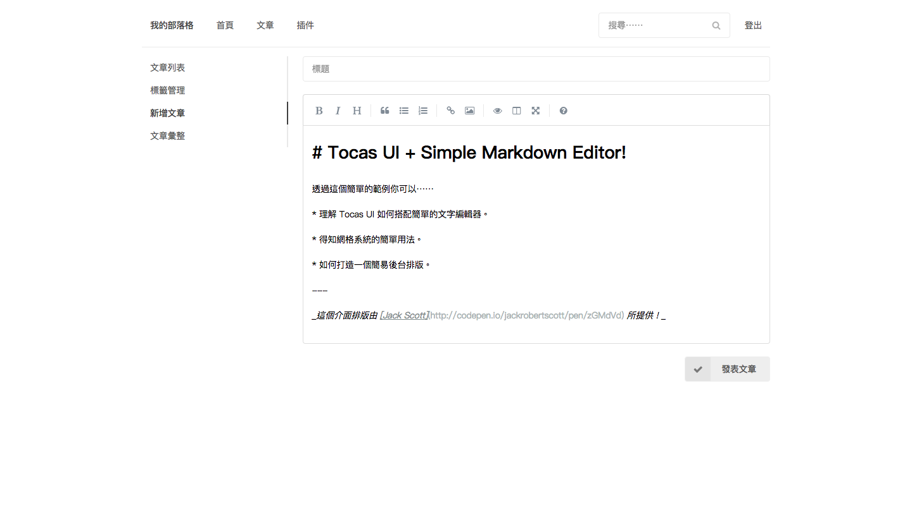

# Examples

這是用來存放官方 Tocas UI 範例的原始碼倉庫，這個文件會列出此原始碼倉庫所帶有的範例與其螢幕截圖。你能夠在 Tocas UI 文件中的[實際範例](https://tocas-ui.com/examples/)頁面中看見這份列表。

範例原始碼皆存放於 `/pages` 資料夾中，且採用 MIT 版權可供商業、自由使用、修改、轉發。

## 後台儀表板 - Dashboard

一個擁有側邊欄並像企業網站的後台管理介面。

線上範例：[https://examples.tocas-ui.com/pages/dashboard.html](https://examples.tocas-ui.com/pages/dashboard.html)

原始碼：[https://github.com/TocasUI/Examples/blob/master/pages/dashboard.html](https://github.com/TocasUI/Examples/blob/master/pages/dashboard.html)

## GitHub

透過 Tocas UI 所打造與 GitHub 類似的網站範例。

線上範例：[https://examples.tocas-ui.com/pages/github.html](https://examples.tocas-ui.com/pages/github.html)

原始碼：[https://github.com/TocasUI/Examples/blob/master/pages/github.html](https://github.com/TocasUI/Examples/blob/master/pages/github.html)

## CMS 前台 - CMS Frontend

常態型的小型商業 CMS 內容管理網站前台頁面，很適合用於團體、企業的公告或新聞網站。

線上範例：[https://examples.tocas-ui.com/pages/cms.html](https://examples.tocas-ui.com/pages/cms.html)

原始碼：[https://github.com/TocasUI/Examples/blob/master/pages/cms.html](https://github.com/TocasUI/Examples/blob/master/pages/cms.html)

## 電子郵件信箱 - Mailbox

網頁電子信箱的郵件檢視頁面，並夾帶數個檔案附件。

線上範例：[https://examples.tocas-ui.com/pages/mailbox.html](https://examples.tocas-ui.com/pages/mailbox.html)

原始碼：[https://github.com/TocasUI/Examples/blob/master/pages/mailbox.html](https://github.com/TocasUI/Examples/blob/master/pages/mailbox.html)

## 募資平台 - Crowdfunding

透過卡片與網格系統實現類似募資平台的專案列表佈局。

線上範例：[https://examples.tocas-ui.com/pages/crowdfunding.html](https://examples.tocas-ui.com/pages/crowdfunding.html)

原始碼：[https://github.com/TocasUI/Examples/blob/master/pages/crowdfunding.html](https://github.com/TocasUI/Examples/blob/master/pages/crowdfunding.html)

## 網路硬碟 - Network Disk

類似 FTP 等網路硬碟的目錄與檔案資訊範例。

線上範例：[https://examples.tocas-ui.com/pages/network-disk.html](https://examples.tocas-ui.com/pages/network-disk.html)

原始碼：[https://github.com/TocasUI/Examples/blob/master/pages/network-disk.html](https://github.com/TocasUI/Examples/blob/master/pages/network-disk.html)

## 發票與收據 - Invoice

用於企業之間所開立的電子發票，或是出貨單。

線上範例：[https://examples.tocas-ui.com/pages/invoice.html](https://examples.tocas-ui.com/pages/invoice.html)

原始碼：[https://github.com/TocasUI/Examples/blob/master/pages/invoice.html](https://github.com/TocasUI/Examples/blob/master/pages/invoice.html)

## 信用卡付款 - Payment

於商品結帳時所請求的信用卡資料頁面，並附帶商品資訊。

線上範例：[https://examples.tocas-ui.com/pages/payment.html](https://examples.tocas-ui.com/pages/payment.html)

原始碼：[https://github.com/TocasUI/Examples/blob/master/pages/payment.html](https://github.com/TocasUI/Examples/blob/master/pages/payment.html)

## 註冊頁面 - Registration

基本的使用者註冊頁面，並要求性別、生日、暱稱⋯⋯等資訊。

線上範例：[https://examples.tocas-ui.com/pages/registration.html](https://examples.tocas-ui.com/pages/registration.html)

原始碼：[https://github.com/TocasUI/Examples/blob/master/pages/registration.html](https://github.com/TocasUI/Examples/blob/master/pages/registration.html)

## 部落格後台 - Post Publication

簡易型的個人部落格後台文章發佈頁面。

線上範例：[https://examples.tocas-ui.com/pages/blog-editor.html](https://examples.tocas-ui.com/pages/blog-editor.html)

原始碼：[https://github.com/TocasUI/Examples/blob/master/pages/blog-editor.html](https://github.com/TocasUI/Examples/blob/master/pages/blog-editor.html)

## 計算機 - Calculator

由多個按鈕所組成的基本小型計算機。

線上範例：[https://examples.tocas-ui.com/pages/calculator.html](https://examples.tocas-ui.com/pages/calculator.html)

原始碼：[https://github.com/TocasUI/Examples/blob/master/pages/calculator.html](https://github.com/TocasUI/Examples/blob/master/pages/calculator.html)

## 文字編輯器 - Editor

與 Simple Markdown Editor 所搭配的基本文字編輯器。

線上範例：[https://examples.tocas-ui.com/pages/editor.html](https://examples.tocas-ui.com/pages/editor.html)

原始碼：[https://github.com/TocasUI/Examples/blob/master/pages/editor.html](https://github.com/TocasUI/Examples/blob/master/pages/editor.html)

## 郵件模板 - Mail Template

用於寄送給網站會員的郵件內容，並推銷網站產品於宣佈公告。

線上範例：[https://examples.tocas-ui.com/pages/mail-template.html](https://examples.tocas-ui.com/pages/mail-template.html)

原始碼：[https://github.com/TocasUI/Examples/blob/master/pages/mail-template.html](https://github.com/TocasUI/Examples/blob/master/pages/mail-template.html)

## 個人相簿 - Gallery

供單人所設計的小型相簿靜態網站。

線上範例：[https://examples.tocas-ui.com/pages/gallery.html](https://examples.tocas-ui.com/pages/gallery.html)

原始碼：[https://github.com/TocasUI/Examples/blob/master/pages/gallery.html](https://github.com/TocasUI/Examples/blob/master/pages/gallery.html)

## 登入頁面 - Login

基本的帳號與密碼登入頁面。

線上範例：[https://examples.tocas-ui.com/pages/login.html](https://examples.tocas-ui.com/pages/login.html)

原始碼：[https://github.com/TocasUI/Examples/blob/master/pages/login.html](https://github.com/TocasUI/Examples/blob/master/pages/login.html)

## 行動原生應用程式 - Native Application

以 Tocas UI 做出類似 App Store 的原生應用市集，供行動裝置檢視。

線上範例：[https://examples.tocas-ui.com/pages/native.html](https://examples.tocas-ui.com/pages/native.html)

原始碼：[https://github.com/TocasUI/Examples/blob/master/pages/native.html](https://github.com/TocasUI/Examples/blob/master/pages/native.html)

## 聊天室 - Chatroom

透過對話元件和片段、卡片所組成的輕量級聊天室。

線上範例：[https://examples.tocas-ui.com/pages/chatroom.html](https://examples.tocas-ui.com/pages/chatroom.html)

原始碼：[https://github.com/TocasUI/Examples/blob/master/pages/chatroom.html](https://github.com/TocasUI/Examples/blob/master/pages/chatroom.html)

## 部落格 - Blog

以基本的文字元素還有簡易的網格系統與選單所組成的個人部落格網站。

線上範例：[https://examples.tocas-ui.com/pages/blog.html](https://examples.tocas-ui.com/pages/blog.html)

原始碼：[https://github.com/TocasUI/Examples/blob/master/pages/blog.html](https://github.com/TocasUI/Examples/blob/master/pages/blog.html)

## 便利貼 - Notes

以卡片瀑布流實現類似 Google Keep 那樣的網路便利貼服務。

線上範例：[https://examples.tocas-ui.com/pages/notes.html](https://examples.tocas-ui.com/pages/notes.html)

原始碼：[https://github.com/TocasUI/Examples/blob/master/pages/notes.html](https://github.com/TocasUI/Examples/blob/master/pages/notes.html)

